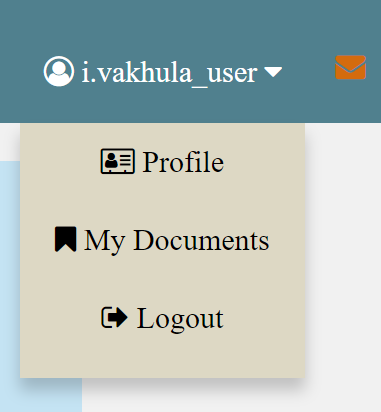
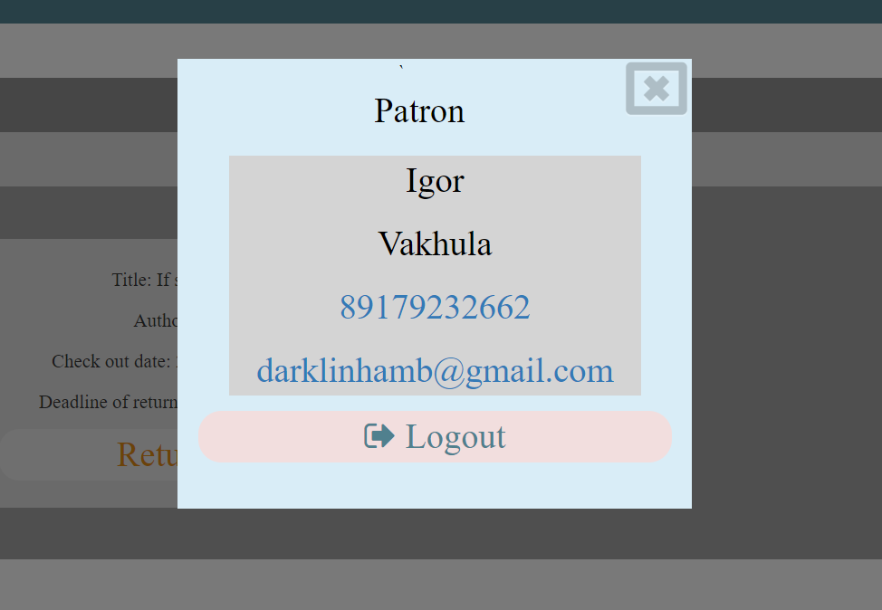

Firstly, you must have an account, you can ask about it admin of this library. If you have
you just need to write you login and password and press the button "Sign up"

After authorization you can have different pages, depends on your role.
 
 1.Patron(for professors, TA and students)
    
    There, you can find manual, how to use this library, cat animation, you need to press on it, and many buttons at the top.
    ***DeepLib(also label for this library) always return you to the welcome page
    ***Searching bar, there you can write title and press the button "title" or find documents by other parameters(such as Description, Authors) and press button "full"
    ***If you press on the section Media/Journal Article or Books you will be on the page with list of media/journal articles or books respectively
    like this one     
    For all documents you can check out it/stand to the queue/ return or renew.To know more information about document you need just to press on this doc
    ***On the right side you can find label for notification and also label for you personal information
    
    ***in section "Profile" your have your personal information   
        
    ***in section "My documents" you can see documents, which you choose, and also you can manage it 
        
    ***"Log Out" to exit from DeepLib
  2.Librarian
    