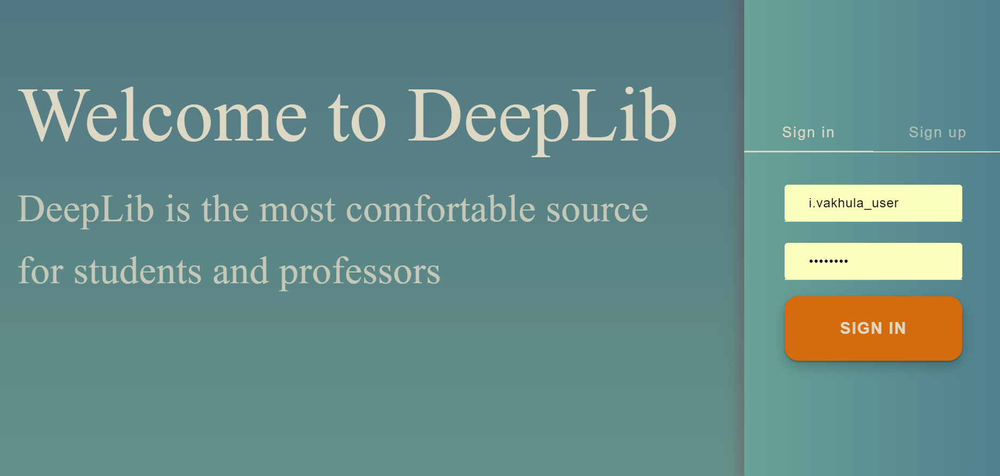

 **DeepLib** 
 ====================
#### Innovation in Library Managment System

------------------------------
### There are 4 contributors in our Team (DeepLib Team)

1. Maksimychev Evgenij - Test Cases and Java Classes that are connected with Objects such as Librarian, Patron and etc.
 
2. Uzbekova Ekaterina - Frontend (HTML, CSS, JS, Bootstrap and etc.)
3. Yudinskikh Yaroslav - Database and Backend (Java, MySQL, Spring and etc.)
4. Vakhula Igor - Database and Backend (Java, MySQL, Spring and etc.)
###How to use DeepLib:

[all documentation](/Documentation.md) you can find there.
 
### **How to install our project on your PC** 

+ Install:
  - Java 1.8.
  - Intelliji IDEA Ultimate.
  - Internet Connection.
         

1. Download from this repository .zip and unarchive
2. Open **Intellij IDEA -> "Open" -> "Choose unarchived project-folder"**.
3. Setup Java SDK from your location.
4. In the lower right corner of IDEA windows should opens message of Maven, click on "AutoImport"
5. If this exist skip this point, else you should do this by hands in IDEA:
      **View - > Tool Windows -> Maven Project -> Above the inscription "Spring SecurityApp Maven Webapp" press on button "Reimport All Maven Projects"**
6. Make sure that port '8080' of your 'localhost' not busy. 

### DATABASE SETTINGS:
1. Open MYSQL WorkBench and create new connection:
Connection name: Deep_Library
Hostname: 127.0.0.1
Port: 3306
Username: root
Password: Click on "Store in Vault" and text "root"
Press "OK"
2. Create a new scheme in the connected server  
   Call it "deep_library_3rd_delivery"
   Choose Collation "utf - utf-general-ci"
   Press "Apply"
   Press "Apply"
   Press "Finish"
3. Now open our project in Intellij IDEA.
4. View -> Tool Windows -> Database -> Add new (green button) -> Data Source -> MySQL
   Put this info to the fields:
   Database: deep_library_3rd_delivery
   User: root
   Password: *your password*
   URL: jdbc:mysql://127.0.0.1/deep_library_3rd_delivery
   **PRESS Test Connection** if you succeed **PRESS OK** if you do not succeed please try one more time
5. go to database properties and change password from "root" to your if you have different
6. Click right button on the "database.sql" and choose execution target "deep_library_3rd_delivery@127.0.0.1 [*the bigger number*]" and press "OK"
7. go to **src -> main -> java -> netspringsecurityapp -> dao -> ForTesting -> DocDaoImpl.java**  and change "root" to your password if you have different
   src -> main -> resources -> database.properties and change "root" to your password if you have different
8. You are done!

 ### To start WEB-application:
  1. **View - > Tool Windows -> Maven Project - > click on "Spring SecurityApp Maven Webapp" -> Plugins -> jetty -> jetty:run**
  2. At Web-browser put in address line "[localhost:8080](http://localhost:8080)"
  3. Some account for **Sing In**:
    *Account of Admin:
      + username: admin
      + password: adminadmin
     *Account of Librarian_3:
      + username: Igor'an
      + password: hellohello
    *Account of Librarian_2:
      + username: bbbbbbbbbbbbb
      + password: bbbbbbbbbbbbb
    * Account of Patron:
      + username: i.vakhula_user
      + password: useruser
   4.if you have some problem with login, and you saw the message "Username or password is incorrect.", but it isn't true, try to login one more time.
   5.
 ### For check TEST CASES:
 
 1. Go to src\test\java\net.proselyte.springsecurityapp directory
 2. And compile and run file file with title "TestCases_<dd>_<mm>" where dd_mm is date of delivery
 
 
### 

